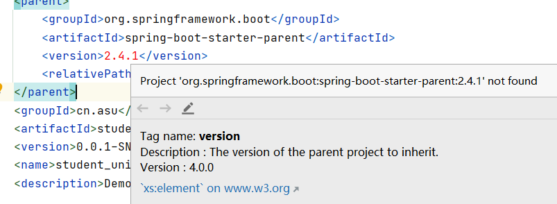

# Student-Union-Management-System

# 说明

小组项目，学生会管理系统，使用前后端分离开发：Spring Boot + Vue

# Vue-cli前端页面开发

> 参考：
>
> [朝雨忆轻尘 - 博客园 (cnblogs.com)](https://www.cnblogs.com/xifengxiaoma/)：https://www.cnblogs.com/xifengxiaoma/p/9533018.html
>
> [超详细！4小时开发一个SpringBoot+vue前后端分离博客项目！！ - MarkerHub](https://www.markerhub.com/project/97)：https://www.markerhub.com/project/97

## 一、前言

可能会使用的到技术如下：

- vue-cli

- element-ui

- axios

开发环境

- Node JS（npm）
- Visual Studio Code（前端IDE）

## 二、环境准备

首先我们安装vue-cli的环境，环境是windows 10。

### 1、安装Visual Studio Code

官网下载地址：https://code.visualstudio.com/

Visual Studio Code 是一款非常优秀的开源编辑器，非常适合作为前端IDE。

### 2、安装Node

根据自己的系统下载相应的版本进行安装。首先我们上node.js官网(https://nodejs.org/zh-cn/)，下载最新的长期版本，直接运行安装完成之后，我们就已经具备了node和npm的环境啦。


安装完成之后检查下版本信息：

```shell
#node的版本
node -v
#npm的版本
npm -v
```


如果你安装的是旧版本的 npm，可以很容易得通过 npm 命令来升级。

```shell
# windows
npm install npm -g
#linux
sudo npm install npm -g
```

可以看到升级之后，再次执行 npm -v 查看版本已经升级到 6.14.9 了。


npm官方源访问速度实在不敢恭维，建议使用之前切换为淘宝镜像：

```shell
npm config set registry https://registry.npm.taobao.org
#查看一下当前源
npm config get registry
```


### 3、安装 Yarn

Yarn 是 Facebook 发布的 node.js 包管理器，它比 npm 更快、更高效，可以使用 Yarn 替代 npm 。

如果你安装了node，就安装了npm，可以使用下面的命令来安装：

```shell
npm i yarn -g --verbose
#查看版本
yarn -v
```


在yarn安装完毕之后执行如下指令：

```shell
#切换为淘宝源
yarn config set registry https://registry.npm.taobao.org
#或者切换为自带的
yarn config set registry https://registry.yarnpkg.com

#查看一下当前源
yarn config get registry
```


到此为止我们就可以在项目中像使用npm一样使用yarn了。

使用 Yarn 跟 npm 差别不大，具体命令关系如下：

```sh
npm install  => yarn install
npm install --save [package] => yarn add [package]
npm install --save-dev [package] => yarn add [package] --dev
npm install --global [package] => yarn global add [package]
npm uninstall --save [package] => yarn remove [package]
npm uninstall --save-dev [package] => yarn remove [package]
```

### 4、安装 webpack

> [安装 | webpack 中文网 (webpackjs.com)](https://www.webpackjs.com/guides/installation/)：https://www.webpackjs.com/guides/installation/

安装打包工具 webpack，-g 表示全局安装。

```shell
npm install webpack -g
```


查看webpack版本信息

```shell
npm info webpack
```


通常我们会将 Webpack 安装到项目的依赖中，这样就可以使用项目本地版本的 Webpack。

```sh
#确定已有package.json，没有就npm init 创建
npm install webpack --save-dev
```

安装 webpack-cli（此工具用于在命令行中运行 webpack）

```sh
npm install webpack webpack-cli --save-dev
```


如果要使用webpack开发工具，要单独安装 webpack-dev-server。

```sh
npm install webpack-dev-server --save-dev
```

### 5、安装 vue-cli

安装 vue 脚手架项目初始化工具 vue-cli，-g 表示全局安装。

```bash
npm install -g @vue/cli
#或者
yarn global add @vue/cli

#查看vue-cli版本
vue -V
```


升级全局的 Vue CLI 包，请运行：

```bash
npm update -g @vue/cli
#或者
yarn global upgrade --latest @vue/cli
```

## 三、创建项目

### 1、建立项目

```sh
vue create student_union_web
```


### 2、导入项目

打开 Visual Studio Code，导入项目，运行命令打开页面（http://localhost:8080/）。

```sh
#运行项目
npm run serve
```


**ps：设置启动服务自动打开默认浏览器，只要在后写入`--open`即可**


# Spring Boot后端

> 参考
>
> [朝雨忆轻尘 - 博客园 (cnblogs.com)](https://www.cnblogs.com/xifengxiaoma/)：https://www.cnblogs.com/xifengxiaoma/p/9474953.html
>
> [超详细！4小时开发一个SpringBoot+vue前后端分离博客项目！！ - MarkerHub](https://www.markerhub.com/project/97)：https://www.markerhub.com/project/97

## 一、前言

可能会使用的到

软件：

- idea
- navicat
- Typora

技术：

- spring boot

开发环境：

- maven 3.6.3
- jdk 11

## 二、创建项目

1、选择springboot；


2、选择相应的选项；


3、选择需要的依赖，注意spring boot的版本；


4、放入相应的位置；


5、等待下载完成。


**注意：**

新建项目spring boot依赖出错，可以换成其他版本（如：2.4.0）或者网络良好时重新建立项目，没有出现则忽略。



**ps：**

目前用到的依赖有：

```xml
<!--web-->
<dependency>
    <groupId>org.springframework.boot</groupId>
    <artifactId>spring-boot-starter-web</artifactId>
</dependency>

<!--mysql数据库驱动-->
<dependency>
    <groupId>mysql</groupId>
    <artifactId>mysql-connector-java</artifactId>
    <scope>runtime</scope>
</dependency>

<!--lombok-->
<dependency>
    <groupId>org.projectlombok</groupId>
    <artifactId>lombok</artifactId>
    <optional>true</optional>
</dependency>
```

## 三、运行项目

1、properties为yml

修改application后缀properties为yml，并添加端口号。

```yml
server:
  port: 8081
```


2、启动


