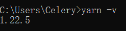
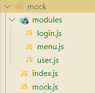
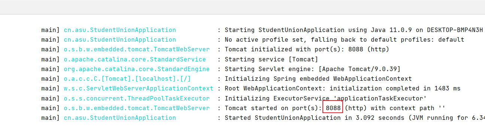
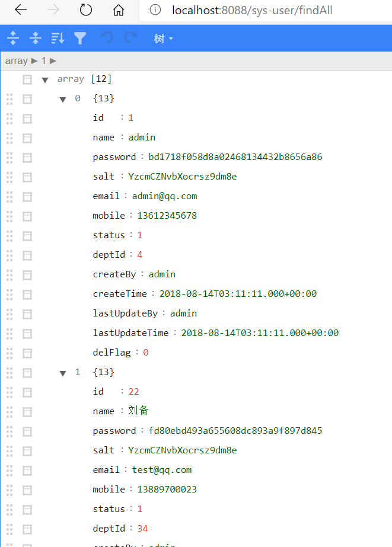

# Student-Union-Management-System

# 说明

小组项目，学生会管理系统，使用前后端分离开发：Spring Boot + Vue

前端：https://github.com/QinQinIsMyObject/Student-Union-Management-System/tree/main/student_union_vue

后端：https://github.com/QinQinIsMyObject/Student-Union-Management-System/tree/main/student_union

# Vue-cli前端页面开发

> 转载：[朝雨忆轻尘 - 博客园 (cnblogs.com)](https://www.cnblogs.com/xifengxiaoma/)：https://www.cnblogs.com/xifengxiaoma/p/9533018.html
>
> 参考：[超详细！4小时开发一个SpringBoot+vue前后端分离博客项目！！ - MarkerHub](https://www.markerhub.com/project/97)：https://www.markerhub.com/project/97

## 一、前言

可能会使用的到技术如下：

- vue-cli

- element-ui

- axios

开发环境

- Node JS（npm）
- Visual Studio Code（前端IDE）

## 二、环境准备

首先我们安装vue-cli的环境，环境是windows 10。

### 1、安装Visual Studio Code

官网下载地址：https://code.visualstudio.com/

Visual Studio Code 是一款非常优秀的开源编辑器，非常适合作为前端IDE。

### 2、安装Node

根据自己的系统下载相应的版本进行安装。首先我们上node.js官网(https://nodejs.org/zh-cn/)，下载最新的长期版本，直接运行安装完成之后，我们就已经具备了node和npm的环境啦。


安装完成之后检查下版本信息：

```shell
#node的版本
node -v
#npm的版本
npm -v
```


如果你安装的是旧版本的 npm，可以很容易得通过 npm 命令来升级。

```shell
# windows
npm install npm -g
#linux
sudo npm install npm -g
```

可以看到升级之后，再次执行 npm -v 查看版本已经升级到 6.14.9 了。


npm官方源访问速度实在不敢恭维，建议使用之前切换为淘宝镜像：

```shell
npm config set registry https://registry.npm.taobao.org
#查看一下当前源
npm config get registry
```


### 3、安装 Yarn

Yarn 是 Facebook 发布的 node.js 包管理器，它比 npm 更快、更高效，可以使用 Yarn 替代 npm 。

如果你安装了node，就安装了npm，可以使用下面的命令来安装：

```shell
npm i yarn -g --verbose
#查看版本
yarn -v
```




在yarn安装完毕之后执行如下指令：

```shell
#切换为淘宝源
yarn config set registry https://registry.npm.taobao.org
#或者切换为自带的
yarn config set registry https://registry.yarnpkg.com

#查看一下当前源
yarn config get registry
```


到此为止我们就可以在项目中像使用npm一样使用yarn了。

使用 Yarn 跟 npm 差别不大，具体命令关系如下：

```sh
npm install  => yarn install
npm install --save [package] => yarn add [package]
npm install --save-dev [package] => yarn add [package] --dev
npm install --global [package] => yarn global add [package]
npm uninstall --save [package] => yarn remove [package]
npm uninstall --save-dev [package] => yarn remove [package]
```

### 4、安装 webpack

> [安装 | webpack 中文网 (webpackjs.com)](https://www.webpackjs.com/guides/installation/)：https://www.webpackjs.com/guides/installation/

安装打包工具 webpack，-g 表示全局安装。

```shell
npm install webpack -g
```


查看webpack版本信息

```shell
npm info webpack
```


通常我们会将 Webpack 安装到项目的依赖中，这样就可以使用项目本地版本的 Webpack。

```sh
#确定已有package.json，没有就npm init 创建
npm install webpack --save-dev
```

安装 webpack-cli（此工具用于在命令行中运行 webpack）

```sh
npm install webpack webpack-cli --save-dev
```


如果要使用webpack开发工具，要单独安装 webpack-dev-server。

```sh
npm install webpack-dev-server --save-dev
```

### 5、安装 vue-cli

安装 vue 脚手架项目初始化工具 vue-cli，-g 表示全局安装。

```bash
npm install -g @vue/cli
#或者
yarn global add @vue/cli

#查看vue-cli版本
vue -V
```


升级全局的 Vue CLI 包，请运行：

```bash
npm update -g @vue/cli
#或者
yarn global upgrade --latest @vue/cli
```

## 三、创建项目

### 1、建立项目

```sh
vue create student_union_vue
```


### 2、导入项目

打开 Visual Studio Code，导入项目，运行命令打开页面（http://localhost:8080/）。

```sh
#运行项目
npm run serve
```


**ps：设置启动服务自动打开默认浏览器，只要在后写入`--open`即可**


## 四、添加依赖框架

### 1、Element—UI

**安装依赖**

​		Element 是国内饿了么公司提供的一套开源前端框架，简洁优雅，提供了 vue、react、angular 等多个版本，我们这里使用 vue 版本来搭建我们的界面。访问：http://element-cn.eleme.io/#/zh-CN/component/installation ，官方指南，包含框架的安装，组件的使用等的全方位的教程。

按照安装指南，我们选择 npm 的安装方式。我们使用 Yarn ，可以用 yarn add element-ui 命令替代。

```shell
#安装element依赖
yarn add element-ui 或 npm i element-ui -S 或 vue add element
```


**依赖导入**

按照安装指南，在 main.js 中引入 element，引入之后，main.js 内容如下：

```js
// 引入element-ui
import ElementUI from 'element-ui';
import 'element-ui/lib/theme-chalk/index.css';
Vue.use(ElementUI);
```

项目引入之后，我们在原有的 HelloWorld.vue 页面中加入一个 element 的按钮，测试一下；Element 官网组件教程案例中，包含大量组件使用场景，直接复制组件代码到项目页面即可；HelloWorld.vue 页面加入一个测试按钮。

```vue
<el-button type="primary" round>主要按钮</el-button>
```


 如下图所示，说明组件已经成功引入了。


### 2、页面路由

**添加页面**

删除和HelloWord.vue相关文件；在 views 目录下添加三个页面，Login.vue，Home.vue，404.vue；三个页面内容简单相似，只有简单的页面标识，如登录页面是 “Login Page”。

Login.vue

```vue
<template>
  <div class="page">
    <h2>Login Page</h2>
  </div>
</template>

<script>
export default {
  name: "Login",
};
</script>
```

**配置路由**

打开 router/index.js，添加三个路由，分别对应主页、登录和404页面。

```js
import Vue from 'vue'
import VueRouter from 'vue-router'

import Login from '@/views/Login'
import Home from '@/views/Home'
import NotFound from '@/views/404'

Vue.use(VueRouter)

const routes = [
  {
    path: '/',
    name: 'Home',
    component: Home
  },
  {
    path: '/login',
    name: 'Login',
    component: Login
  },
  {
    path: '/404',
    name: 'notFound',
    component: NotFound
  }
]

const router = new VueRouter({
  routes
})

export default router
```

浏览器重新访问下面不同路径，路由器会根据路径路由到相应的页面。

http://localhost:8080/#/，/ 路由到 Home Page；http://localhost:8080/#/login，/login 路由到 Login Page；http://localhost:8080/#/404，/404 路由到 404 Error Page。


### 2、axios

​	安装axios（http://www.axios-js.com/），axios是一个基于 promise 的 HTTP 库，这样我们进行前后端对接的时候，使用这个工具可以提高我们的开发效率。

```sh
#安装命令
yarn add axios 或 vue add axios
```


 安装完成后，修改 Home.vue 进行简单的安装测试。

```vue
<template>
  <div class="page">
    <h2>Home Page</h2>
    <el-button type="primary" @click="testAxios()">测试axios调用</el-button>
  </div>
</template>

<script>
import axios from "axios";

export default {
  name: "Home",
  methods: {
    testAxios() {
      axios
        .get("http://localhost:8080")
        .then(function (res) {
          alert(res.data);
        })
        .catch(function (res) {
          alert(res);
        });
    },
  },
};
</script>
```


### 3、安装 Mock.js

为了模拟后台接口提供页面需要的数据，我们引入 Mock.js 为我们提供模拟数据，而不用依赖于后台接口的完成。

安装依赖：执行如下命令，安装依赖包。

```sh
vue add mockjs 或 yarn add mockjs --dev
```


安装完成之后，我们写个例子测试一下；在 src 目录下新建一个 mock 目录，创建 mock.js，在里面我们模拟了两个接口，分别拦截用户和菜单的请求，并返回相应的数据。

```js
// es6语法引入mock模块
import Mock from 'mockjs';

Mock.mock('http://localhost:8080/user', {
    'name': '@name',
    'email': '@email',
    'age|1-10': 5
});

Mock.mock('http://localhost:8080/menu', {
    'id': '@increment',
    'name': 'menu',
    'order|10-20': 12
});
```

修改 Home.vue，在页面放置两个按钮，分别触发用户和菜单的处理请求，成功后弹出获取结果。

```js
<template>
  <div class="page">
    <h2>Home Page</h2>
    <el-button type="primary" @click="getUser()">获取用户信息</el-button>
    <el-button type="primary" @click="getMenu()">获取菜单信息</el-button>
  </div>
</template>

<script>
import axios from "axios";
import mock from "@/mock/mock.js";

export default {
  methods: {
    getUser() {
      axios
        .get("http://localhost:8080/user")
        .then(function (res) {
          alert(JSON.stringify(res.data));
        })
        .catch(function (res) {
          alert(res);
        });
    },
    getMenu() {
      axios
        .get("http://localhost:8080/menu")
        .then(function (res) {
          alert(JSON.stringify(res.data));
        })
        .catch(function (res) {
          alert(res);
        });
    },
  },
};
</script>
```

浏览器访问：http://localhost:8080/#/，分别点击两个按钮，mock 会根据请求 url 拦截对应请求并返回模拟数据。


### 4、安装 js-cookie

用到 Cookie 获取 token，所以需要把相关依赖安装一下，执行以下命令，安装依赖包。

```powershell
yarn add js-cookie
```


**附加：安装 SCSS（可忽略，因为在创建项目时已经添加过）**

安装依赖：因为后续会用到 SCSS 编写页面样式，所以先安装好 SCSS。

```sh
yarn add sass-loader node-sass --dev
```

添加配置：在build文件夹下的webpack.base.conf.js的 rules 标签下添加配置。

```js
{
　　test: /\.scss$/,
　　loaders: ['style', 'css', 'sass']
}
```

如何使用：在页面代码 style 标签中把 lang 设置成 scss 即可。

```vue
<style lang="scss">

</style>
```

使用测试

丰富一下 404.vue 页面内容，加入 scss 样式，移除 App.vue 的 logo 图片。

```js
<template>
  <div class="site-wrapper site-page--not-found">
    <div class="site-content__wrapper">
      <div class="site-content">
        <h2 class="not-found-title">404</h2>
        <p class="not-found-desc">抱歉！您访问的页面<em>失联</em>啦 ...</p>
        <el-button @click="$router.go(-1)">返回上一页</el-button>
        <el-button
          type="primary"
          class="not-found-btn-gohome"
          @click="$router.push('/')"
          >进入首页</el-button
        >
      </div>
    </div>
  </div>
</template>

<script>
export default {};
</script>

<style lang="scss" scope>
.site-wrapper.site-page--not-found {
  position: absolute;
  top: 60px;
  right: 0;
  bottom: 0;
  left: 0;
  overflow: hidden;
  .site-content__wrapper {
    padding: 0;
    margin: 0;
    background-color: #fff;
  }
  .site-content {
    position: fixed;
    top: 15%;
    left: 50%;
    z-index: 2;
    padding: 30px;
    text-align: center;
    transform: translate(-50%, 0);
  }
  .not-found-title {
    margin: 20px 0 15px;
    font-size: 8em;
    font-weight: 500;
    color: rgb(55, 71, 79);
  }
  .not-found-desc {
    margin: 0 0 30px;
    font-size: 26px;
    text-transform: uppercase;
    color: rgb(118, 131, 143);
    > em {
      font-style: normal;
      color: #ee8145;
    }
  }
  .not-found-btn-gohome {
    margin-left: 30px;
  }
}
</style>
```

访问：http://localhost:8080/#/404， 正确显示修改后的 404 页面效果。


## 五、工具模块封装

### 1、封装 axios 模块

**封装背景**

​		使用axios发起一个请求是比较简单的事情，但是axios没有进行封装复用，项目越来越大，会引起越来越多的代码冗余，让代码变得越来越难维护。所以我们在这里先对 axios 进行二次封装，使项目中各个组件能够复用请求，让代码变得更容易维护。

**封装要点**

- 统一 url 配置
- 统一 api 请求
- request (请求) 拦截器，例如：带上token等，设置请求头
- response (响应) 拦截器，例如：统一错误处理，页面重定向等
- 根据需要，结合 Vuex 做全局的 loading 动画，或者错误处理
- 将 axios 封装成 Vue 插件使用

**文件结构**

在 src 目录下，新建一个 http 文件夹，用来存放 http 交互 api 代码。


**axios.js：**二次封装 axios 模块，包含拦截器等信息。
**config.js：**axios 默认配置，包含基础路径等信息。
**index.js：**将 axios 封装成插件，按插件方式引入。
**interface.js** ：请求接口汇总模块，聚合模块 API。

axios.js

```js
import axios from 'axios';
import config from './config';
import qs from 'qs';
import Cookies from "js-cookie";
import router from '@/router'

// 使用vuex做全局loading时使用
// import store from '@/store'

export default function $axios(options) {
    return new Promise((resolve, reject) => {
        const instance = axios.create({
            baseURL: config.baseURL,
            headers: {},
            transformResponse: [function (data) {
            }]
        })

        // request 拦截器
        instance.interceptors.request.use(
            config => {
                let token = Cookies.get('token')
                // 1. 请求开始的时候可以结合 vuex 开启全屏 loading 动画
                // console.log(store.state.loading)
                // console.log('准备发送请求...')
                // 2. 带上token
                if (token) {
                    config.headers.accessToken = token
                } else {
                    // 重定向到登录页面
                    router.push('/login')
                }
                // 3. 根据请求方法，序列化传来的参数，根据后端需求是否序列化
                if (config.method === 'post') {
                    if (config.data.__proto__ === FormData.prototype
                        || config.url.endsWith('path')
                        || config.url.endsWith('mark')
                        || config.url.endsWith('patchs')
                    ) {

                    } else {
                        config.data = qs.stringify(config.data)
                    }
                }
                return config
            },

            error => {
                // 请求错误时
                console.log('request:', error)
                // 1. 判断请求超时
                if (error.code === 'ECONNABORTED' && error.message.indexOf('timeout') !== -1) {
                    console.log('timeout请求超时')
                    // return service.request(originalRequest);// 再重复请求一次
                }
                // 2. 需要重定向到错误页面
                const errorInfo = error.response
                console.log(errorInfo)
                if (errorInfo) {
                    error = errorInfo.data  // 页面那边catch的时候就能拿到详细的错误信息,看最下边的Promise.reject
                    const errorStatus = errorInfo.status; // 404 403 500 ...
                    router.push({
                        path: `/error/${errorStatus}`
                    })
                }
                return Promise.reject(error) // 在调用的那边可以拿到(catch)你想返回的错误信息
            }
        )

        // response 拦截器
        instance.interceptors.response.use(
            response => {
                let data;
                // IE9时response.data是undefined，因此需要使用response.request.responseText(Stringify后的字符串)
                if (response.data == undefined) {
                    data = JSON.parse(response.request.responseText)
                } else {
                    data = response.data
                }

                // 根据返回的code值来做不同的处理
                switch (data.rc) {
                    case 1:
                        console.log(data.desc)
                        break;
                    case 0:
                        store.commit('changeState')
                    // console.log('登录成功')
                    default:
                }
                // 若不是正确的返回code，且已经登录，就抛出错误
                // const err = new Error(data.desc)
                // err.data = data
                // err.response = response
                // throw err

                return data
            },
            err => {
                if (err && err.response) {
                    switch (err.response.status) {
                        case 400:
                            err.message = '请求错误'
                            break
                        case 401:
                            err.message = '未授权，请登录'
                            break
                        case 403:
                            err.message = '拒绝访问'
                            break
                        case 404:
                            err.message = `请求地址出错: ${err.response.config.url}`
                            break
                        case 408:
                            err.message = '请求超时'
                            break
                        case 500:
                            err.message = '服务器内部错误'
                            break
                        case 501:
                            err.message = '服务未实现'
                            break
                        case 502:
                            err.message = '网关错误'
                            break
                        case 503:
                            err.message = '服务不可用'
                            break
                        case 504:
                            err.message = '网关超时'
                            break
                        case 505:
                            err.message = 'HTTP版本不受支持'
                            break
                        default:
                    }
                }
                console.error(err)
                return Promise.reject(err) // 返回接口返回的错误信息
            }
        )

        // 请求处理
        instance(options).then(res => {
            resolve(res)
            return false
        }).catch(error => {
            reject(error)
        })
    })
}
```

config.js

```js
export default {
    method: 'get',
    // 基础url前缀
    baseURL: 'http://localhost:8080/',
    // 请求头信息
    headers: {
        'Content-Type': 'application/json;charset=UTF-8'
    },
    // 参数
    data: {},
    // 设置超时时间
    timeout: 10000,
    // 携带凭证
    withCredentials: true,
    // 返回数据类型
    responseType: 'json'
}
```

index.js

```js
// 导入所有接口
import apis from './interface'

const install = Vue => {
    if (install.installed)
        return;

    install.installed = true;

    Object.defineProperties(Vue.prototype, {
        // 注意，此处挂载在 Vue 原型的 $api 对象上
        $api: {
            get() {
                return apis
            }
        }
    })
}

export default install
```

interface.js

```js
import axios from './axios'

/* 
 * 将所有接口统一起来便于维护
 * 如果项目很大可以将 url 独立成文件，接口分成不同的模块
 */

// 单独导出
export const login = () => {
    return axios({
        url: '/login',
        method: 'get'
    })
}

export const getUser = () => {
    return axios({
        url: '/user',
        method: 'get'
    })
}

export const getMenu = data => {
    return axios({
        url: '/menu',
        method: 'post',
        data
    })
}

// 默认全部导出
export default {
    login,
    getUser,
    getMenu
}
```

**代码实例**

1.引入插件：在 main.js 中以 vue 插件的形式引入 axios，这样在其他地方就可通过 this.$api 调用相关的接口了。

```js
// 以 vue 插件的形式引入 axios，这样在其他地方就可通过 this.$api 调用相关的接口
import api from './http/index.js'
Vue.use(api)
```

2.编写接口：在 interface.js 中添加 login 接口。


3.调用接口：在登录界面 Login.vue 中，添加一个登录按钮，点击处理函数通过 axios 调用 login 接口返回数据；成功返回之后，将 token 放入 Cookie 并跳转到主页。

```vue
<template>
  <div class="page">
    <h2>Login Page</h2>
    <el-button type="primary" @click="login()">登录</el-button>
  </div>
</template>

<script>
  import mock from '@/mock/mock.js';
  import Cookies from "js-cookie";
  import router from '@/router'
  export default {
    name: 'Login',
    methods: {
      login() {
        this.$api.login().then(function(res) {　　　　　　　alert(res.data.token)
            Cookies.set('token', res.data.token) // 放置token到Cookie 
            router.push('/')  // 登录成功，跳转到主页
          }).catch(function(res) {
            alert(res);
          });
          
      }
    }
  }
</script>
```

4.mock 接口：在 mock.js 中添加 login 接口进行拦截，返回一个 token。

```js
// login 接口进行拦截，返回一个 token
Mock.mock('http://localhost:8080/login', {
    data: {
        'token': '4344323424398'
        // 其他数据
    },
})
```

5.启动测试：浏览器访问：http://localhost:8080/#/login，显示登录界面。


点击登录按钮，首先弹出框，显示返回的 token 信息。


点击确定关掉弹出框后，跳转到主页。点击用户、菜单按钮，接口调用正常。


### 2、封装 mock 模块

为了统一可以统一管理和集中控制数据模拟接口，我们对 mock 模块进行了封装，可以方便的定制模拟接口的统一开关和个体开关。

**文件结构**

在 mock 目录下新建一个 index.js ，创建 modules 目录并在里面创建三个模块 *.js 文件。



**index.js**：模拟接口模块聚合文件

**login.js**：登录相关的接口模拟

**menu.js**：菜单相关的接口模拟

**user.js**：用户相关的接口模拟

index.js

```js
import Mock from 'mockjs'
import * as login from './modules/login'
import * as user from './modules/user'
import * as menu from './modules/menu'

// 1. 开启/关闭[业务模块]拦截, 通过调用fnCreate方法[isOpen参数]设置.
// 2. 开启/关闭[业务模块中某个请求]拦截, 通过函数返回对象中的[isOpen属性]设置.
fnCreate(login, true)
fnCreate(user, true)
fnCreate(menu, true)

/**
 * 创建mock模拟数据
 * @param {*} mod 模块
 * @param {*} isOpen 是否开启?
 */
function fnCreate(mod, isOpen = true) {
    if (isOpen) {
        for (var key in mod) {
            ((res) => {
                if (res.isOpen !== false) {
                    Mock.mock(new RegExp(res.url), res.type, (opts) => {
                        opts['data'] = opts.body ? JSON.parse(opts.body) : null
                        delete opts.body
                        console.log('\n')
                        console.log('%cmock拦截, 请求: ', 'color:blue', opts)
                        console.log('%cmock拦截, 响应: ', 'color:blue', res.data)
                        return res.data
                    })
                }
            })(mod[key]() || {})
        }
    }
}
```

login.js

```js
// 登录接口
export function login() {
    return {
        // isOpen: false,
        url: 'http://localhost:8080/login',
        type: 'get',
        data: {
            'msg': 'success',
            'code': 0,
            'data': {
                'token': '4344323121398'
                // 其他数据
            }
        }
    }
}
```

menu.js

```js
// 获取菜单信息
export function getMenu() {
    return {
        // isOpen: false,
        url: 'http://localhost:8080/menu',
        type: 'get',
        data: {
            'msg': 'success',
            'code': 0,
            'data': {
                'id': '@increment',
                'name': 'menu', // 随机生成姓名
                'order|10-20': 12
                // 其他数据
            }
        }
    }
}
```

user.js

```js
// 获取用户信息
export function getUser() {
    return {
        // isOpen: false,
        url: 'http://localhost:8080/user',
        type: 'get',
        data: {
            'msg': 'success',
            'code': 0,
            'data': {
                'id': '@increment',
                'name': '@name', // 随机生成姓名
                'email': '@email', // 随机生成姓名
                'age|10-20': 12
                // 其他数据
            }
        }
    }
}
```

**修改引入**：Login.vue及Home.vue

```js
// import mock from "@/mock/mock.js";
import mock from "@/mock/index.js";
```

测试：浏览器访问：http://localhost:8080/#/，按照先前流程走一遍，没有问题。


## 六、优化登录流程


# Spring Boot后端

> 转自：[朝雨忆轻尘 - 博客园 (cnblogs.com)](https://www.cnblogs.com/xifengxiaoma/)：https://www.cnblogs.com/xifengxiaoma/p/9474953.html
>
> 参考：[超详细！4小时开发一个SpringBoot+vue前后端分离博客项目！！ - MarkerHub](https://www.markerhub.com/project/97)：https://www.markerhub.com/project/97

## 一、前言

可能会使用的到

软件：

- idea
- navicat
- Typora

技术：

- spring boot

开发环境：

- maven 3.6.3
- jdk 11

## 二、数据库设计

​		系统主要包含用户（sys_user）、角色(sys_role)、部门(sys_dept)、角色部门(sys_role_dept)、菜单(sys_menu)、角色菜单(sys_role_menu)、用户Token(sys_user_token)、系统日志(sys_log)等表。

1.用户属于部门，通过 sys_user 表中的 dept_id 关联到部门。

2.部门拥有角色，通过角色部门表关联。

3.用户拥有角色，通过用户角色表关联，用户可以继承部门的角色。

4.角色关联菜单，菜单关联权限，角色通过角色菜单表关联到菜单表。

### 表结构

**用户表**

```sql
CREATE TABLE `sys_user` (
  `id` bigint NOT NULL AUTO_INCREMENT COMMENT '编号',
  `name` varchar(50) NOT NULL COMMENT '用户名',
  `password` varchar(100) DEFAULT NULL COMMENT '密码',
  `salt` varchar(40) DEFAULT NULL COMMENT '盐',
  `email` varchar(100) DEFAULT NULL COMMENT '邮箱',
  `mobile` varchar(100) DEFAULT NULL COMMENT '手机号',
  `status` tinyint DEFAULT NULL COMMENT '状态  0：禁用   1：正常',
  `dept_id` bigint DEFAULT NULL COMMENT '机构ID',
  `create_by` varchar(50) DEFAULT NULL COMMENT '创建人',
  `create_time` datetime DEFAULT NULL COMMENT '创建时间',
  `last_update_by` varchar(50) DEFAULT NULL COMMENT '更新人',
  `last_update_time` datetime DEFAULT NULL COMMENT '更新时间',
  `del_flag` tinyint DEFAULT '0' COMMENT '是否删除  -1：已删除  0：正常',
  PRIMARY KEY (`id`),
  UNIQUE KEY `name` (`name`)
) ENGINE=InnoDB AUTO_INCREMENT=33 DEFAULT CHARSET=utf8 COMMENT='用户管理';
```

**角色表**

```sql
CREATE TABLE `sys_role` (
  `id` bigint NOT NULL AUTO_INCREMENT COMMENT '编号',
  `name` varchar(100) DEFAULT NULL COMMENT '角色名称',
  `remark` varchar(100) DEFAULT NULL COMMENT '备注',
  `create_by` varchar(50) DEFAULT NULL COMMENT '创建人',
  `create_time` datetime DEFAULT NULL COMMENT '创建时间',
  `last_update_by` varchar(50) DEFAULT NULL COMMENT '更新人',
  `last_update_time` datetime DEFAULT NULL COMMENT '更新时间',
  `del_flag` tinyint DEFAULT '0' COMMENT '是否删除  -1：已删除  0：正常',
  PRIMARY KEY (`id`)
) ENGINE=InnoDB AUTO_INCREMENT=9 DEFAULT CHARSET=utf8 COMMENT='角色管理';
```

**用户角色表**

```sql
CREATE TABLE `sys_user_role` (
  `id` bigint NOT NULL AUTO_INCREMENT COMMENT '编号',
  `user_id` bigint DEFAULT NULL COMMENT '用户ID',
  `role_id` bigint DEFAULT NULL COMMENT '角色ID',
  `create_by` varchar(50) DEFAULT NULL COMMENT '创建人',
  `create_time` datetime DEFAULT NULL COMMENT '创建时间',
  `last_update_by` varchar(50) DEFAULT NULL COMMENT '更新人',
  `last_update_time` datetime DEFAULT NULL COMMENT '更新时间',
  PRIMARY KEY (`id`)
) ENGINE=InnoDB AUTO_INCREMENT=72 DEFAULT CHARSET=utf8 COMMENT='用户角色';
```

**菜单表**

```sql
CREATE TABLE `sys_menu` (
  `id` bigint NOT NULL AUTO_INCREMENT COMMENT '编号',
  `name` varchar(50) DEFAULT NULL COMMENT '菜单名称',
  `parent_id` bigint DEFAULT NULL COMMENT '父菜单ID，一级菜单为0',
  `url` varchar(200) DEFAULT NULL COMMENT '菜单URL,类型：1.普通页面（如用户管理， /sys/user） 2.嵌套完整外部页面，以http(s)开头的链接 3.嵌套服务器页面，使用iframe:前缀+目标URL(如SQL监控， iframe:/druid/login.html, iframe:前缀会替换成服务器地址)',
  `perms` varchar(500) DEFAULT NULL COMMENT '授权(多个用逗号分隔，如：sys:user:add,sys:user:edit)',
  `type` int DEFAULT NULL COMMENT '类型   0：目录   1：菜单   2：按钮',
  `icon` varchar(50) DEFAULT NULL COMMENT '菜单图标',
  `order_num` int DEFAULT NULL COMMENT '排序',
  `create_by` varchar(50) DEFAULT NULL COMMENT '创建人',
  `create_time` datetime DEFAULT NULL COMMENT '创建时间',
  `last_update_by` varchar(50) DEFAULT NULL COMMENT '更新人',
  `last_update_time` datetime DEFAULT NULL COMMENT '更新时间',
  `del_flag` tinyint DEFAULT '0' COMMENT '是否删除  -1：已删除  0：正常',
  PRIMARY KEY (`id`)
) ENGINE=InnoDB AUTO_INCREMENT=45 DEFAULT CHARSET=utf8 COMMENT='菜单管理';
```

**角色菜单表**

```sql
CREATE TABLE `sys_role_menu` (
  `id` bigint NOT NULL AUTO_INCREMENT COMMENT '编号',
  `role_id` bigint DEFAULT NULL COMMENT '角色ID',
  `menu_id` bigint DEFAULT NULL COMMENT '菜单ID',
  `create_by` varchar(50) DEFAULT NULL COMMENT '创建人',
  `create_time` datetime DEFAULT NULL COMMENT '创建时间',
  `last_update_by` varchar(50) DEFAULT NULL COMMENT '更新人',
  `last_update_time` datetime DEFAULT NULL COMMENT '更新时间',
  PRIMARY KEY (`id`)
) ENGINE=InnoDB AUTO_INCREMENT=445 DEFAULT CHARSET=utf8 COMMENT='角色菜单';
```

**机构表**

```sql
CREATE TABLE `sys_dept` (
  `id` bigint NOT NULL AUTO_INCREMENT COMMENT '编号',
  `name` varchar(50) DEFAULT NULL COMMENT '机构名称',
  `parent_id` bigint DEFAULT NULL COMMENT '上级机构ID，一级机构为0',
  `order_num` int DEFAULT NULL COMMENT '排序',
  `create_by` varchar(50) DEFAULT NULL COMMENT '创建人',
  `create_time` datetime DEFAULT NULL COMMENT '创建时间',
  `last_update_by` varchar(50) DEFAULT NULL COMMENT '更新人',
  `last_update_time` datetime DEFAULT NULL COMMENT '更新时间',
  `del_flag` tinyint DEFAULT '0' COMMENT '是否删除  -1：已删除  0：正常',
  PRIMARY KEY (`id`)
) ENGINE=InnoDB AUTO_INCREMENT=36 DEFAULT CHARSET=utf8 COMMENT='机构管理';
```

**角色机构表**

```sql
CREATE TABLE `sys_role_dept` (
  `id` bigint NOT NULL AUTO_INCREMENT COMMENT '编号',
  `role_id` bigint DEFAULT NULL COMMENT '角色ID',
  `dept_id` bigint DEFAULT NULL COMMENT '机构ID',
  `create_by` varchar(50) DEFAULT NULL COMMENT '创建人',
  `create_time` datetime DEFAULT NULL COMMENT '创建时间',
  `last_update_by` varchar(50) DEFAULT NULL COMMENT '更新人',
  `last_update_time` datetime DEFAULT NULL COMMENT '更新时间',
  PRIMARY KEY (`id`)
) ENGINE=InnoDB DEFAULT CHARSET=utf8 COMMENT='角色机构';
```

**用户Token表**

```sql
CREATE TABLE `sys_user_token` (
  `id` bigint NOT NULL AUTO_INCREMENT COMMENT '编号',
  `user_id` bigint NOT NULL,
  `token` varchar(100) NOT NULL COMMENT 'token',
  `expire_time` datetime DEFAULT NULL COMMENT '过期时间',
  `create_by` varchar(50) DEFAULT NULL COMMENT '创建人',
  `create_time` datetime DEFAULT NULL COMMENT '创建时间',
  `last_update_by` varchar(50) DEFAULT NULL COMMENT '更新人',
  `last_update_time` datetime DEFAULT NULL COMMENT '更新时间',
  PRIMARY KEY (`id`),
  UNIQUE KEY `token` (`token`)
) ENGINE=InnoDB AUTO_INCREMENT=5 DEFAULT CHARSET=utf8 COMMENT='用户Token';
```

**系统日志表**

```sql
CREATE TABLE `sys_log` (
  `id` bigint NOT NULL AUTO_INCREMENT COMMENT '编号',
  `user_name` varchar(50) DEFAULT NULL COMMENT '用户名',
  `operation` varchar(50) DEFAULT NULL COMMENT '用户操作',
  `method` varchar(200) DEFAULT NULL COMMENT '请求方法',
  `params` varchar(5000) DEFAULT NULL COMMENT '请求参数',
  `time` bigint NOT NULL COMMENT '执行时长(毫秒)',
  `ip` varchar(64) DEFAULT NULL COMMENT 'IP地址',
  `create_by` varchar(50) DEFAULT NULL COMMENT '创建人',
  `create_time` datetime DEFAULT NULL COMMENT '创建时间',
  `last_update_by` varchar(50) DEFAULT NULL COMMENT '更新人',
  `last_update_time` datetime DEFAULT NULL COMMENT '更新时间',
  PRIMARY KEY (`id`)
) ENGINE=InnoDB AUTO_INCREMENT=1754 DEFAULT CHARSET=utf8 COMMENT='系统日志';
```

**数据字典表**

```sql
CREATE TABLE `sys_dict` (
  `id` bigint NOT NULL AUTO_INCREMENT COMMENT '编号',
  `value` varchar(100) NOT NULL COMMENT '数据值',
  `label` varchar(100) NOT NULL COMMENT '标签名',
  `type` varchar(100) NOT NULL COMMENT '类型',
  `description` varchar(100) NOT NULL COMMENT '描述',
  `sort` decimal(10,0) NOT NULL COMMENT '排序（升序）',
  `create_by` varchar(50) DEFAULT NULL COMMENT '创建人',
  `create_time` datetime DEFAULT NULL COMMENT '创建时间',
  `last_update_by` varchar(50) DEFAULT NULL COMMENT '更新人',
  `last_update_time` datetime DEFAULT NULL COMMENT '更新时间',
  `remarks` varchar(255) DEFAULT NULL COMMENT '备注信息',
  `del_flag` tinyint DEFAULT '0' COMMENT '是否删除  -1：已删除  0：正常',
  PRIMARY KEY (`id`)
) ENGINE=InnoDB AUTO_INCREMENT=5 DEFAULT CHARSET=utf8 COMMENT='字典表';
```

### 完整SQL脚本

将完整的SQL脚本保存到SQL文件，放置在resources目录下，以便保存修改。

```sql
-- ----------------------------------------------------
--  用户
-- ----------------------------------------------------
--  Table structure for `sys_user`
-- ----------------------------------------------------
CREATE TABLE `sys_user` (
  `id` bigint NOT NULL AUTO_INCREMENT COMMENT '编号',
  `name` varchar(50) NOT NULL COMMENT '用户名',
  `password` varchar(100) COMMENT '密码',
  `salt` varchar(40) COMMENT '盐',
  `email` varchar(100) COMMENT '邮箱',
  `mobile` varchar(100) COMMENT '手机号',
  `status` tinyint COMMENT '状态  0：禁用   1：正常',
  `dept_id` bigint(20) COMMENT '机构ID',
  `create_by` varchar(50) COMMENT '创建人',
  `create_time` datetime COMMENT '创建时间',
  `last_update_by` varchar(50) COMMENT '更新人',
  `last_update_time` datetime COMMENT '更新时间',
  `del_flag` tinyint DEFAULT 0 COMMENT '是否删除  -1：已删除  0：正常',
  PRIMARY KEY (`id`),
  UNIQUE INDEX (`name`)
) ENGINE=InnoDB DEFAULT CHARSET=utf8 COMMENT='用户';

-- ----------------------------------------------------
--  机构
-- ------------------------------------------------
--  Table structure for `sys_dept`
-- ------------------------------------------------
CREATE TABLE `sys_dept` (
  `id` bigint NOT NULL AUTO_INCREMENT COMMENT '编号',
  `name` varchar(50) COMMENT '机构名称',
  `parent_id` bigint COMMENT '上级机构ID，一级机构为0',
  `order_num` int COMMENT '排序',
  `create_by` varchar(50) COMMENT '创建人',
  `create_time` datetime COMMENT '创建时间',
  `last_update_by` varchar(50) COMMENT '更新人',
  `last_update_time` datetime COMMENT '更新时间',
  `del_flag` tinyint DEFAULT 0 COMMENT '是否删除  -1：已删除  0：正常',
  PRIMARY KEY (`id`)
) ENGINE=InnoDB DEFAULT CHARSET=utf8 COMMENT='机构管理';

-- ------------------------------------------------
--  角色
-- ------------------------------------------------
--  Table structure for `sys_role`
-- ------------------------------------------------
CREATE TABLE `sys_role` (
  `id` bigint NOT NULL AUTO_INCREMENT COMMENT '编号',
  `name` varchar(100) COMMENT '角色名称',
  `remark` varchar(100) COMMENT '备注',
  `create_by` varchar(50) COMMENT '创建人',
  `create_time` datetime COMMENT '创建时间',
  `last_update_by` varchar(50) COMMENT '更新人',
  `last_update_time` datetime COMMENT '更新时间',
  `del_flag` tinyint DEFAULT 0 COMMENT '是否删除  -1：已删除  0：正常',
  PRIMARY KEY (`id`)
) ENGINE=InnoDB DEFAULT CHARSET=utf8 COMMENT='角色';

-- ------------------------------------------------
--  菜单
-- ------------------------------------------------
--  Table structure for `sys_menu`
-- ------------------------------------------------
CREATE TABLE `sys_menu` (
  `id` bigint NOT NULL AUTO_INCREMENT COMMENT '编号',
  `name` varchar(50) COMMENT '菜单名称',
  `parent_id` bigint COMMENT '父菜单ID，一级菜单为0',
  `url` varchar(200) COMMENT '菜单URL',
  `perms` varchar(500) COMMENT '授权(多个用逗号分隔，如：user:view,user:create)',
  `type` int COMMENT '类型   0：目录   1：菜单   2：按钮',
  `icon` varchar(50) COMMENT '菜单图标',
  `order_num` int COMMENT '排序',
  `create_by` varchar(50) COMMENT '创建人',
  `create_time` datetime COMMENT '创建时间',
  `last_update_by` varchar(50) COMMENT '更新人',
  `last_update_time` datetime COMMENT '更新时间',
  `del_flag` tinyint DEFAULT 0 COMMENT '是否删除  -1：已删除  0：正常',
  PRIMARY KEY (`id`)
) ENGINE=InnoDB DEFAULT CHARSET=utf8 COMMENT='菜单管理';

-- ------------------------------------------------
--  用户与角色对应关系
-- ------------------------------------------------
--  Table structure for `sys_user_role`
-- ------------------------------------------------
CREATE TABLE `sys_user_role` (
  `id` bigint NOT NULL AUTO_INCREMENT COMMENT '编号',
  `user_id` bigint COMMENT '用户ID',
  `role_id` bigint COMMENT '角色ID',
  `create_by` varchar(50) COMMENT '创建人',
  `create_time` datetime COMMENT '创建时间',
  `last_update_by` varchar(50) COMMENT '更新人',
  `last_update_time` datetime COMMENT '更新时间',
  PRIMARY KEY (`id`)
) ENGINE=InnoDB DEFAULT CHARSET=utf8 COMMENT='用户与角色对应关系';

-- ------------------------------------------------
--  角色与机构对应关系
-- ------------------------------------------------
--  Table structure for `sys_role_dept`
-- ------------------------------------------------
CREATE TABLE `sys_role_dept` (
  `id` bigint NOT NULL AUTO_INCREMENT COMMENT '编号',
  `role_id` bigint COMMENT '角色ID',
  `dept_id` bigint COMMENT '机构ID',
  `create_by` varchar(50) COMMENT '创建人',
  `create_time` datetime COMMENT '创建时间',
  `last_update_by` varchar(50) COMMENT '更新人',
  `last_update_time` datetime COMMENT '更新时间',
  PRIMARY KEY (`id`)
) ENGINE=InnoDB DEFAULT CHARSET=utf8 COMMENT='角色与机构对应关系';

-- ------------------------------------------------
--  角色与菜单对应关系
-- ------------------------------------------------
--  Table structure for `sys_role_menu`
-- ------------------------------------------------
CREATE TABLE `sys_role_menu` (
  `id` bigint NOT NULL AUTO_INCREMENT COMMENT '编号',
  `role_id` bigint COMMENT '角色ID',
  `menu_id` bigint COMMENT '菜单ID',
  `create_by` varchar(50) COMMENT '创建人',
  `create_time` datetime COMMENT '创建时间',
  `last_update_by` varchar(50) COMMENT '更新人',
  `last_update_time` datetime COMMENT '更新时间',
  PRIMARY KEY (`id`)
) ENGINE=InnoDB DEFAULT CHARSET=utf8 COMMENT='角色与菜单对应关系';

-- ------------------------------------------------
--  用户Token
-- ------------------------------------------------
--  Table structure for `sys_user_token`
-- ------------------------------------------------
CREATE TABLE `sys_user_token` (
  `id` bigint NOT NULL AUTO_INCREMENT COMMENT '编号',
  `user_id` bigint NOT NULL,
  `token` varchar(100) NOT NULL COMMENT 'token',
  `expire_time` datetime DEFAULT NULL COMMENT '过期时间',
  `create_by` varchar(50) COMMENT '创建人',
  `create_time` datetime COMMENT '创建时间',
  `last_update_by` varchar(50) COMMENT '更新人',
  `last_update_time` datetime COMMENT '更新时间',
  PRIMARY KEY (`id`),
  UNIQUE KEY `token` (`token`)
) ENGINE=InnoDB DEFAULT CHARSET=utf8 COMMENT='用户Token';

-- ------------------------------------------------
--  系统日志
-- ------------------------------------------------
--  Table structure for `sys_log`
-- ------------------------------------------------
CREATE TABLE `sys_log` (
  `id` bigint NOT NULL AUTO_INCREMENT COMMENT '编号',
  `user_name` varchar(50) COMMENT '用户名',
  `operation` varchar(50) COMMENT '用户操作',
  `method` varchar(200) COMMENT '请求方法',
  `params` varchar(5000) COMMENT '请求参数',
  `time` bigint NOT NULL COMMENT '执行时长(毫秒)',
  `ip` varchar(64) COMMENT 'IP地址',
  `create_by` varchar(50) COMMENT '创建人',
  `create_time` datetime COMMENT '创建时间',
  `last_update_by` varchar(50) COMMENT '更新人',
  `last_update_time` datetime COMMENT '更新时间',
  PRIMARY KEY (`id`)
) ENGINE=`InnoDB` DEFAULT CHARACTER SET utf8 COMMENT='系统日志';

-- ------------------------------------------------
--  数据字典
-- ------------------------------------------------
--  Table structure for `sys_dict`
-- ------------------------------------------------
DROP TABLE IF EXISTS `sys_dict`;
CREATE TABLE `sys_dict` (
  `id` bigint NOT NULL AUTO_INCREMENT COMMENT '编号',
  `value` varchar(100) NOT NULL COMMENT '数据值',
  `label` varchar(100) NOT NULL COMMENT '标签名',
  `type` varchar(100) NOT NULL COMMENT '类型',
  `description` varchar(100) NOT NULL COMMENT '描述',
  `sort` decimal(10,0) NOT NULL COMMENT '排序（升序）',
  `create_by` varchar(50) COMMENT '创建人',
  `create_time` datetime COMMENT '创建时间',
  `last_update_by` varchar(50) COMMENT '更新人',
  `last_update_time` datetime COMMENT '更新时间',
  `remarks` varchar(255) DEFAULT NULL COMMENT '备注信息',
  `del_flag` tinyint DEFAULT 0 COMMENT '是否删除  -1：已删除  0：正常',
  PRIMARY KEY (`id`)
) ENGINE=InnoDB DEFAULT CHARSET=utf8 COMMENT='字典表';

-- --------------------------------------
-- 初始数据
-- --------------------------------------
--  Records of `sys_user`
-- --------------------------------------
INSERT INTO `sys_user` (`id`, `name`, `password`, `salt`, `dept_id`, `email`, `mobile`, `status`, `create_time`) VALUES ('1', 'admin', '9ec9750e709431dad22365cabc5c625482e574c74adaebba7dd02f1129e4ce1d', 'YzcmCZNvbXocrsz9dm8e', '4', 'admin@qq.com', '13612345678', '1', '2018-08-14 11:11:11');
INSERT INTO `sys_user` (`id`, `name`, `password`, `salt`, `dept_id`, `email`, `mobile`, `status`, `create_time`) VALUES ('2', 'Louis', '9ec9750e709431dad22365cabc5c625482e574c74adaebba7dd02f1129e4ce1d', 'YzcmCZNvbXocrsz9dm8e', '6', 'louis@qq.com', '18200932238', '1', '2018-08-14 11:11:11');
INSERT INTO `sys_user` (`id`, `name`, `password`, `salt`, `dept_id`, `email`, `mobile`, `status`, `create_time`) VALUES ('3', 'Kobe', '9ec9750e709431dad22365cabc5c625482e574c74adaebba7dd02f1129e4ce1d', 'YzcmCZNvbXocrsz9dm8e', '7', 'kobe@qq.com', '18200932238', '1', '2018-08-14 11:11:11');
INSERT INTO `sys_user` (`id`, `name`, `password`, `salt`, `dept_id`, `email`, `mobile`, `status`, `create_time`) VALUES ('4', 'Iverson', '9ec9750e709431dad22365cabc5c625482e574c74adaebba7dd02f1129e4ce1d', 'YzcmCZNvbXocrsz9dm8e', '8', 'iverson@qq.com', '18200932238', '1', '2018-08-14 11:11:11');
INSERT INTO `sys_user` (`id`, `name`, `password`, `salt`, `dept_id`, `email`, `mobile`, `status`, `create_time`) VALUES ('5', 'Iverson5', '9ec9750e709431dad22365cabc5c625482e574c74adaebba7dd02f1129e4ce1d', 'YzcmCZNvbXocrsz9dm8e', '12', 'iverson@qq.com', '18200932238', '1', '2018-08-14 11:11:11');
INSERT INTO `sys_user` (`id`, `name`, `password`, `salt`, `dept_id`, `email`, `mobile`, `status`, `create_time`) VALUES ('6', 'Iverson6', '9ec9750e709431dad22365cabc5c625482e574c74adaebba7dd02f1129e4ce1d', 'YzcmCZNvbXocrsz9dm8e', '12', 'iverson@qq.com', '18200932238', '1', '2018-08-14 11:11:11');
INSERT INTO `sys_user` (`id`, `name`, `password`, `salt`, `dept_id`, `email`, `mobile`, `status`, `create_time`) VALUES ('7', 'Iverson7', '9ec9750e709431dad22365cabc5c625482e574c74adaebba7dd02f1129e4ce1d', 'YzcmCZNvbXocrsz9dm8e', '13', 'iverson@qq.com', '18200932238', '1', '2018-08-14 11:11:11');
INSERT INTO `sys_user` (`id`, `name`, `password`, `salt`, `dept_id`, `email`, `mobile`, `status`, `create_time`) VALUES ('8', 'Iverson8', '9ec9750e709431dad22365cabc5c625482e574c74adaebba7dd02f1129e4ce1d', 'YzcmCZNvbXocrsz9dm8e', '14', 'iverson@qq.com', '18200932238', '1', '2018-08-14 11:11:11');
INSERT INTO `sys_user` (`id`, `name`, `password`, `salt`, `dept_id`, `email`, `mobile`, `status`, `create_time`) VALUES ('9', 'Iverson9', '9ec9750e709431dad22365cabc5c625482e574c74adaebba7dd02f1129e4ce1d', 'YzcmCZNvbXocrsz9dm8e', '15', 'iverson@qq.com', '18200932238', '1', '2018-08-14 11:11:11');
INSERT INTO `sys_user` (`id`, `name`, `password`, `salt`, `dept_id`, `email`, `mobile`, `status`, `create_time`) VALUES ('10', 'Iverson10', '9ec9750e709431dad22365cabc5c625482e574c74adaebba7dd02f1129e4ce1d', 'YzcmCZNvbXocrsz9dm8e', '4', 'iverson@qq.com', '18200932238', '1', '2018-08-14 11:11:11');
INSERT INTO `sys_user` (`id`, `name`, `password`, `salt`, `dept_id`, `email`, `mobile`, `status`, `create_time`) VALUES ('11', 'Iverson11', '9ec9750e709431dad22365cabc5c625482e574c74adaebba7dd02f1129e4ce1d', 'YzcmCZNvbXocrsz9dm8e', '6', 'iverson@qq.com', '18200932238', '1', '2018-08-14 11:11:11');
INSERT INTO `sys_user` (`id`, `name`, `password`, `salt`, `dept_id`, `email`, `mobile`, `status`, `create_time`) VALUES ('12', 'Iverson12', '9ec9750e709431dad22365cabc5c625482e574c74adaebba7dd02f1129e4ce1d', 'YzcmCZNvbXocrsz9dm8e', '15', 'iverson@qq.com', '18200932238', '1', '2018-08-14 11:11:11');
-- --------------------------------------
--  Records of `sys_role`
-- --------------------------------------
INSERT INTO `sys_role` (`id`, `name`, `remark`, `create_time`) VALUES ('1', 'admin', '超级管理员', '2018-08-14 11:11:11');
INSERT INTO `sys_role` (`id`, `name`, `remark`, `create_time`) VALUES ('2', 'dev', '开发人员', '2018-08-14 11:11:11');
INSERT INTO `sys_role` (`id`, `name`, `remark`, `create_time`) VALUES ('3', 'test', '测试人员', '2018-08-14 11:11:11');
-- --------------------------------------
--  Records of `sys_user_role`
-- --------------------------------------
INSERT INTO `sys_user_role` (`id`, `user_id`, `role_id`) VALUES ('1', '1', '1');
INSERT INTO `sys_user_role` (`id`, `user_id`, `role_id`) VALUES ('2', '2', '1');
INSERT INTO `sys_user_role` (`id`, `user_id`, `role_id`) VALUES ('3', '3', '2');
INSERT INTO `sys_user_role` (`id`, `user_id`, `role_id`) VALUES ('4', '4', '3');
-- --------------------------------------
--  Records of `sys_dept`
-- --------------------------------------
INSERT INTO `sys_dept` (`id`, `parent_id`, `name`, `order_num`, `del_flag`) VALUES ('1', '0', '轻尘集团', '0', '0');
INSERT INTO `sys_dept` (`id`, `parent_id`, `name`, `order_num`, `del_flag`) VALUES ('2', '1', '北京分公司', '1', '0');
INSERT INTO `sys_dept` (`id`, `parent_id`, `name`, `order_num`, `del_flag`) VALUES ('3', '1', '上海分公司', '2', '0');
INSERT INTO `sys_dept` (`id`, `parent_id`, `name`, `order_num`, `del_flag`) VALUES ('4', '3', '技术部', '0', '0');
INSERT INTO `sys_dept` (`id`, `parent_id`, `name`, `order_num`, `del_flag`) VALUES ('6', '3', '宣传部', '1', '0');
INSERT INTO `sys_dept` (`id`, `parent_id`, `name`, `order_num`, `del_flag`) VALUES ('7', '3', '销售部', '2', '0');
INSERT INTO `sys_dept` (`id`, `parent_id`, `name`, `order_num`, `del_flag`) VALUES ('8', '3', '市场部', '3', '0');
INSERT INTO `sys_dept` (`id`, `parent_id`, `name`, `order_num`, `del_flag`) VALUES ('9', '0', '牧尘集团', '1', '0');
INSERT INTO `sys_dept` (`id`, `parent_id`, `name`, `order_num`, `del_flag`) VALUES ('10', '9', '北京分公司', '1', '0');
INSERT INTO `sys_dept` (`id`, `parent_id`, `name`, `order_num`, `del_flag`) VALUES ('11', '9', '上海分公司', '2', '0');
INSERT INTO `sys_dept` (`id`, `parent_id`, `name`, `order_num`, `del_flag`) VALUES ('12', '10', '技术部', '1', '0');
INSERT INTO `sys_dept` (`id`, `parent_id`, `name`, `order_num`, `del_flag`) VALUES ('13', '10', '宣传部', '2', '0');
INSERT INTO `sys_dept` (`id`, `parent_id`, `name`, `order_num`, `del_flag`) VALUES ('14', '11', '销售部', '1', '0');
INSERT INTO `sys_dept` (`id`, `parent_id`, `name`, `order_num`, `del_flag`) VALUES ('15', '11', '市场部', '2', '0');
-- --------------------------------------
--  Records of `sys_menu`
-- --------------------------------------
INSERT INTO `sys_menu` (`id`, `parent_id`, `name`, `url`, `perms`, `type`, `icon`, `order_num`) VALUES ('1', '0', '系统管理', NULL, NULL, '0', 'fa el-icon-setting', '0');
INSERT INTO `sys_menu` (`id`, `parent_id`, `name`, `url`, `perms`, `type`, `icon`, `order_num`) VALUES ('2', '1', '用户管理', '/sys/user', NULL, '1', 'el-icon-service', '1');
INSERT INTO `sys_menu` (`id`, `parent_id`, `name`, `url`, `perms`, `type`, `icon`, `order_num`) VALUES ('3', '1', '机构管理', '/sys/dept', NULL, '1', 'el-icon-news', '2');
INSERT INTO `sys_menu` (`id`, `parent_id`, `name`, `url`, `perms`, `type`, `icon`, `order_num`) VALUES ('4', '1', '角色管理', '/sys/role', NULL, '1', 'el-icon-view', '4');
INSERT INTO `sys_menu` (`id`, `parent_id`, `name`, `url`, `perms`, `type`, `icon`, `order_num`) VALUES ('5', '1', '菜单管理', '/sys/menu', NULL, '1', 'el-icon-menu', '5');
INSERT INTO `sys_menu` (`id`, `parent_id`, `name`, `url`, `perms`, `type`, `icon`, `order_num`) VALUES ('6', '1', 'SQL监控', '/druid/sql', NULL, '1', 'el-icon-info', '6');
INSERT INTO `sys_menu` (`id`, `parent_id`, `name`, `url`, `perms`, `type`, `icon`, `order_num`) VALUES ('8', '1', '系统日志', '/sys/log', 'sys:log:view', '1', 'el-icon-info', '7');
INSERT INTO `sys_menu` (`id`, `parent_id`, `name`, `url`, `perms`, `type`, `icon`, `order_num`) VALUES ('9', '2', '查看', NULL, 'sys:user:view', '2', NULL, '0');
INSERT INTO `sys_menu` (`id`, `parent_id`, `name`, `url`, `perms`, `type`, `icon`, `order_num`) VALUES ('10', '2', '新增', NULL, 'sys:user:add', '2', NULL, '0');
INSERT INTO `sys_menu` (`id`, `parent_id`, `name`, `url`, `perms`, `type`, `icon`, `order_num`) VALUES ('11', '2', '修改', NULL, 'sys:user:edit', '2', NULL, '0');
INSERT INTO `sys_menu` (`id`, `parent_id`, `name`, `url`, `perms`, `type`, `icon`, `order_num`) VALUES ('12', '2', '删除', NULL, 'sys:user:delete', '2', NULL, '0');
INSERT INTO `sys_menu` (`id`, `parent_id`, `name`, `url`, `perms`, `type`, `icon`, `order_num`) VALUES ('13', '3', '查看', NULL, 'sys:dept:view', '2', NULL, '0');
INSERT INTO `sys_menu` (`id`, `parent_id`, `name`, `url`, `perms`, `type`, `icon`, `order_num`) VALUES ('14', '3', '新增', NULL, 'sys:dept:add', '2', NULL, '0');
INSERT INTO `sys_menu` (`id`, `parent_id`, `name`, `url`, `perms`, `type`, `icon`, `order_num`) VALUES ('15', '3', '修改', NULL, 'sys:dept:edit', '2', NULL, '0');
INSERT INTO `sys_menu` (`id`, `parent_id`, `name`, `url`, `perms`, `type`, `icon`, `order_num`) VALUES ('16', '3', '删除', NULL, 'sys:dept:delete', '2', NULL, '0');
INSERT INTO `sys_menu` (`id`, `parent_id`, `name`, `url`, `perms`, `type`, `icon`, `order_num`) VALUES ('17', '4', '查看', NULL, 'sys:role:view', '2', NULL, '0');
INSERT INTO `sys_menu` (`id`, `parent_id`, `name`, `url`, `perms`, `type`, `icon`, `order_num`) VALUES ('18', '4', '新增', NULL, 'sys:role:add', '2', NULL, '0');
INSERT INTO `sys_menu` (`id`, `parent_id`, `name`, `url`, `perms`, `type`, `icon`, `order_num`) VALUES ('19', '4', '修改', NULL, 'sys:role:edit', '2', NULL, '0');
INSERT INTO `sys_menu` (`id`, `parent_id`, `name`, `url`, `perms`, `type`, `icon`, `order_num`) VALUES ('20', '4', '删除', NULL, 'sys:role:delete', '2', NULL, '0');
INSERT INTO `sys_menu` (`id`, `parent_id`, `name`, `url`, `perms`, `type`, `icon`, `order_num`) VALUES ('21', '5', '查看', NULL, 'sys:menu:view', '2', NULL, '0');
INSERT INTO `sys_menu` (`id`, `parent_id`, `name`, `url`, `perms`, `type`, `icon`, `order_num`) VALUES ('22', '5', '新增', NULL, 'sys:menu:add', '2', NULL, '0');
INSERT INTO `sys_menu` (`id`, `parent_id`, `name`, `url`, `perms`, `type`, `icon`, `order_num`) VALUES ('23', '5', '修改', NULL, 'sys:menu:edit', '2', NULL, '0');
INSERT INTO `sys_menu` (`id`, `parent_id`, `name`, `url`, `perms`, `type`, `icon`, `order_num`) VALUES ('24', '5', '删除', NULL, 'sys:menu:delete', '2', NULL, '0');
INSERT INTO `sys_menu` (`id`, `parent_id`, `name`, `url`, `perms`, `type`, `icon`, `order_num`) VALUES ('25', '0', '内容管理', NULL, NULL, '0', 'el-icon-document', '0');
INSERT INTO `sys_menu` (`id`, `parent_id`, `name`, `url`, `perms`, `type`, `icon`, `order_num`) VALUES ('26', '25', '栏目管理', '/content/category', NULL, '1', 'el-icon-tickets', '1');
INSERT INTO `sys_menu` (`id`, `parent_id`, `name`, `url`, `perms`, `type`, `icon`, `order_num`) VALUES ('27', '25', '文章管理', '/content/artical', NULL, '1', 'el-icon-tickets', '2');
INSERT INTO `sys_menu` (`id`, `parent_id`, `name`, `url`, `perms`, `type`, `icon`, `order_num`) VALUES ('28', '0', '使用案例', NULL, NULL, '0', 'el-icon-picture-outline', '0');
INSERT INTO `sys_menu` (`id`, `parent_id`, `name`, `url`, `perms`, `type`, `icon`, `order_num`) VALUES ('29', '28', '国际化', '/demo/i18n', NULL, '1', 'el-icon-edit', '1');
INSERT INTO `sys_menu` (`id`, `parent_id`, `name`, `url`, `perms`, `type`, `icon`, `order_num`) VALUES ('30', '28', '换皮肤', '/demo/theme', NULL, '1', 'el-icon-picture', '2');
-- --------------------------------------
--  Records of `sys_role_menu`
-- --------------------------------------
INSERT INTO `sys_role_menu` (`id`, `role_id`, `menu_id`) VALUES ('1', '2', '25');
INSERT INTO `sys_role_menu` (`id`, `role_id`, `menu_id`) VALUES ('2', '2', '26');
INSERT INTO `sys_role_menu` (`id`, `role_id`, `menu_id`) VALUES ('3', '2', '27');
INSERT INTO `sys_role_menu` (`id`, `role_id`, `menu_id`) VALUES ('4', '2', '28');
INSERT INTO `sys_role_menu` (`id`, `role_id`, `menu_id`) VALUES ('5', '2', '29');
INSERT INTO `sys_role_menu` (`id`, `role_id`, `menu_id`) VALUES ('6', '2', '30');
INSERT INTO `sys_role_menu` (`id`, `role_id`, `menu_id`) VALUES ('7', '3', '25');
INSERT INTO `sys_role_menu` (`id`, `role_id`, `menu_id`) VALUES ('8', '3', '26');
INSERT INTO `sys_role_menu` (`id`, `role_id`, `menu_id`) VALUES ('9', '3', '27');
INSERT INTO `sys_role_menu` (`id`, `role_id`, `menu_id`) VALUES ('10', '3', '28');
INSERT INTO `sys_role_menu` (`id`, `role_id`, `menu_id`) VALUES ('11', '3', '29');
INSERT INTO `sys_role_menu` (`id`, `role_id`, `menu_id`) VALUES ('12', '3', '30');

-- --------------------------------------
--  Records of `sys_dict`
-- --------------------------------------
INSERT INTO `sys_dict` (`id`, `value`, `label`, `type`, `description`, `sort`) VALUES ('1', 'male', '男', 'sex', '男性', '0');
INSERT INTO `sys_dict` (`id`, `value`, `label`, `type`, `description`, `sort`) VALUES ('2', 'female', '女', 'sex', '女性', '1');
```

## 三、搭建开发环境

### 创建项目

1、选择springboot；


2、选择相应的选项；


3、选择需要的依赖，注意spring boot的版本；


4、放入相应的位置；


5、等待下载完成。


**注意：**

新建项目spring boot依赖出错，可以换成其他版本（如：2.4.0）或者网络良好时重新建立项目，没有出现则忽略。


**ps：**

目前用到的依赖有：

```xml
<!--web-->
<dependency>
    <groupId>org.springframework.boot</groupId>
    <artifactId>spring-boot-starter-web</artifactId>
</dependency>

<!--mysql数据库驱动-->
<dependency>
    <groupId>mysql</groupId>
    <artifactId>mysql-connector-java</artifactId>
    <scope>runtime</scope>
</dependency>

<!--lombok-->
<dependency>
    <groupId>org.projectlombok</groupId>
    <artifactId>lombok</artifactId>
    <optional>true</optional>
</dependency>
```

### 运行项目

1、properties为yml

改变默认端口：Tomcat默认启动端口是8080，如果需要更换启动端口可以修改默认配置。

port:服务器启动端口，context-path:指定根路径对应的目录。

```yml
server:
  port: 8088
  #指定根路径对应的目录
  context-path: /student_union
  tomcat:
    uri-encoding: UTF-8
```

**ps：自定义Banner**

​		Spring Boot应用启动后会在控制台输出Banner信息，默认是显示 Spring 字样的Banner，如果要定制自己的Banner, 只需要在 resources 下放置一个 baner.txt 文件，输入自己的banner字符即可。

Banner字符可以通过类似以下网站生成：

（推荐）https://www.bootschool.net/ascii

http://patorjk.com/software/taag
http://www.network-science.de/ascii/

重新启动，可以看到效果：


2、测试访问

运行项目，浏览器访问：http://localhost:8088/， 因为我们还没提供可访问内容，所以显示没有可映射访问的内容。




新建一个类来个小小测试，如下图所示：


```java
package cn.asu.controller;

import org.springframework.web.bind.annotation.GetMapping;
import org.springframework.web.bind.annotation.RestController;

/**
 * @author Celery
 */
@RestController
public class HelloController {

    @GetMapping(value = "/hello")
    public Object hello() {
        return "Hello 朝雨忆轻尘!";
    }

}
```

启动运行，浏览器访问 ： localhost:8088/hello ， 可以看到服务已经调用成功了。


## 四、集成 MyBatis 框架

### 方法一：MyBatis（没有实现生成代码）

**引入依赖**

Spring Boot对于MyBatis的支持需要引入mybatis-spring-boot-starter的pom文件。

```xml
<!--mybatis-->
<dependency>
    <groupId>org.mybatis.spring.boot</groupId>
    <artifactId>mybatis-spring-boot-starter</artifactId>
    <version>2.1.4</version>
</dependency>
```

在加添MySQL等相关依赖后，完整的pom.xml：

```xml
<!--web-->
<dependency>
    <groupId>org.springframework.boot</groupId>
    <artifactId>spring-boot-starter-web</artifactId>
</dependency>

<!--mysql数据库驱动-->
<dependency>
    <groupId>mysql</groupId>
    <artifactId>mysql-connector-java</artifactId>
    <scope>runtime</scope>
</dependency>

<!--mybatis-->
<dependency>
    <groupId>org.mybatis.spring.boot</groupId>
    <artifactId>mybatis-spring-boot-starter</artifactId>
    <version>2.1.4</version>
</dependency>

<!--lombok-->
<dependency>
    <groupId>org.projectlombok</groupId>
    <artifactId>lombok</artifactId>
    <optional>true</optional>
</dependency>
```

**添加配置**

1.添加MyBatis配置

​		添加MyBatis配置类，配置相关扫描路径，包括DAO，Model，XML映射文件的扫描；新建com.louis.kitty.admin.config包，并创建一个MyBatis配置类，MybatisConfig.java。

```java

```

2.添加数据源配置

打开 application.yml ，添加MySQL数据源连接信息。

```yml
server:
  port: 8088
  #指定根路径对应的目录
  context-path: /student_union
  tomcat:
    uri-encoding: UTF-8

spring:
  datasource:
    driverClassName: com.mysql.cj.jdbc.Driver
    url: jdbc:mysql://localhost:3306/students_union?useUnicode=true&zeroDateTimeBehavior=convertToNull&autoReconnect=true&characterEncoding=utf-8
    username: root
    password: 123456
```

#### MyBatis Generator生成MyBatis模块

​		由于手动编写MyBatis的Model、DAO、XML映射文件比较繁琐，通常都会通过一些生成工具来生成。MyBatis官方也提供了生成工具（MyBaits Generator），另外还有一些基于官方基础上改进的第三方工具，比如MyBatis Plus就是国内提供的一款非常优秀的开源工具，网上相关教程比较多，这里就不再赘述了。

这里提供一些资料作为参考。

>参考：
>
>Mybatis Generator 官网：http://mybatis.org/generator/index.html
>
>Mybatis Generator 教程：https://blog.csdn.net/testcs_dn/article/details/77881776
>
>[程序羊](https://www.codesheep.cn/)：https://www.codesheep.cn/2019/02/14/mybatis-generator/

代码生成好之后，分別将Domain、DAO、XML映射文件拷贝到相应的包里。


打开Mapper，我们看到MyBatis Generator给我们默认生成了一些增删改查的方法。


### 方法二：MyBatis Plus

>参考：
>
>[程序羊](https://www.codesheep.cn/)：https://www.codesheep.cn/2019/04/12/springbt-mybatis-plus/
>
>[遇见狂神说](https://space.bilibili.com/95256449)：https://www.bilibili.com/video/BV17E411N7KN?p=15
>
>[超详细！4小时开发一个SpringBoot+vue前后端分离博客项目！！ - MarkerHub](https://www.markerhub.com/project/97)：https://www.markerhub.com/project/97
>
>MyBatis Plus 官网：https://baomidou.com/#/
>
> [小超zzzzzzz](https://blog.csdn.net/zgc55987)：https://blog.csdn.net/zgc55987/article/details/108941909

**引入依赖**

Spring Boot对于MyBatis Plus的支持需要引入mybatis-plus-boot-starter的pom文件。

```xml
<!--mybatis-plus-->
<dependency>
    <groupId>com.baomidou</groupId>
    <artifactId>mybatis-plus-boot-starter</artifactId>
    <version>3.4.1</version>
</dependency>
<!--mybatis-plus-generator-->
<dependency>
    <groupId>com.baomidou</groupId>
    <artifactId>mybatis-plus-generator</artifactId>
    <version>3.4.1</version>
</dependency>
```

**注意：mybatis与mybatis plus不要混用！**

在加添MySQL等相关依赖后，完整的pom.xml：

```xml
<!--web-->
<dependency>
    <groupId>org.springframework.boot</groupId>
    <artifactId>spring-boot-starter-web</artifactId>
</dependency>

<!--mysql数据库驱动-->
<dependency>
    <groupId>mysql</groupId>
    <artifactId>mysql-connector-java</artifactId>
    <scope>runtime</scope>
</dependency>

<!--mybatis-plus-->
<dependency>
    <groupId>com.baomidou</groupId>
    <artifactId>mybatis-plus-boot-starter</artifactId>
    <version>3.4.1</version>
</dependency>
<!--mybatis-plus代码生成器-->
<dependency>
    <groupId>com.baomidou</groupId>
    <artifactId>mybatis-plus-generator</artifactId>
    <version>3.4.1</version>
</dependency>

<!--freemarker模板-->
<dependency>
    <groupId>org.freemarker</groupId>
    <artifactId>freemarker</artifactId>
    <version>2.3.30</version>
</dependency>

<!--lombok-->
<dependency>
    <groupId>org.projectlombok</groupId>
    <artifactId>lombok</artifactId>
    <optional>true</optional>
</dependency>
```

**1.配置 MapperScan 注解**：

启动类上添加。

```java
@MapperScan("cn.asu.mybatisplus.mapper")
```

**2.添加数据源配置**

目前完整的application.yml 。

```yml
server:
  port: 8088
  #指定根路径对应的目录
  context-path: /student_union
  tomcat:
    uri-encoding: UTF-8

spring:
  datasource:
    driverClassName: com.mysql.cj.jdbc.Driver
    url: jdbc:mysql://localhost:3306/students_union?useSSL=false&useUnicode=true&characterEncoding=utf-8&serverTimezone=GMT%2B8
    username: root
    password: 123456
  #禁用模板缓存
  thymeleaf:
    cache: false

#mybatis-plus
mybatis-plus:
  mapper-locations: classpath*:/mapper/**Mapper.xml
  #配置日志
  configuration:
    log-impl: org.apache.ibatis.logging.stdout.StdOutImpl
  #逻辑删除配置
  global-config:
    logic-delete-value: 1
    logic-not-delete-value: 0

# Logger Config
logging:
  level:
    cn.asu: debug
```

生成代码的代码：

```java
package cn.asu.generator;

import com.baomidou.mybatisplus.annotation.DbType;
import com.baomidou.mybatisplus.annotation.IdType;
import com.baomidou.mybatisplus.core.exceptions.MybatisPlusException;
import com.baomidou.mybatisplus.core.toolkit.StringPool;
import com.baomidou.mybatisplus.core.toolkit.StringUtils;
import com.baomidou.mybatisplus.generator.AutoGenerator;
import com.baomidou.mybatisplus.generator.InjectionConfig;
import com.baomidou.mybatisplus.generator.config.*;
import com.baomidou.mybatisplus.generator.config.po.TableInfo;
import com.baomidou.mybatisplus.generator.config.rules.DateType;
import com.baomidou.mybatisplus.generator.config.rules.NamingStrategy;
import com.baomidou.mybatisplus.generator.engine.FreemarkerTemplateEngine;

import java.util.ArrayList;
import java.util.List;
import java.util.Scanner;

/**
 * 演示例子，执行 main 方法控制台输入模块表名回车自动生成对应项目目录中
 */
public class CodeGenerator {

    /**
     * 读取控制台内容
     */
    public static String scanner(String tip) {
        //获取控制台输入值
        Scanner scanner = new Scanner(System.in);
        StringBuilder help = new StringBuilder();
        help.append("请输入" + tip + "：");
        System.out.println(help.toString());
        if (scanner.hasNext()) {
            String ipt = scanner.next();
            if (StringUtils.isNotBlank(ipt)) {
                return ipt;
            }
        }
        throw new MybatisPlusException("请输入正确的" + tip + "！");
    }

    public static void main(String[] args) {
        // 代码生成器
        AutoGenerator mpg = new AutoGenerator();

        // 全局配置
        GlobalConfig gc = new GlobalConfig();
        //项目根目录
        String projectPath = System.getProperty("user.dir");
        //用于多个模块下生成到精确的目录下（我设置在桌面）
        //String projectPath = "C:/Users/xie/Desktop";
        //代码生成目录
        gc.setOutputDir(projectPath + "/src/main/java");
        //开发人员
        gc.setAuthor("");
        // 是否打开输出目录(默认值：null)
        gc.setOpen(false);
        // 实体属性 Swagger2 注解
        // gc.setSwagger2(true);
        // 自定义文件命名，注意 %s 会自动填充表实体属性！
//        gc.setMapperName("%sMapper");
//        gc.setXmlName("%sMapper");
        // service 命名方式
        gc.setServiceName("%sService");
        // 是否覆盖已有文件(默认值：false)
        gc.setFileOverride(true);
        gc.setActiveRecord(true);
        // service impl 命名方式
//        gc.setServiceImplName("%sServiceImpl");
        // XML 二级缓存
        gc.setEnableCache(false);
        // XML ResultMap
        gc.setBaseResultMap(true);
        // XML columList
        gc.setBaseColumnList(false);
        // 指定生成的主键的ID类型,默认可以不用设置
        gc.setIdType(IdType.ASSIGN_ID);
        // 时间类型对应策略
        gc.setDateType(DateType.ONLY_DATE);
        //把全局配置添加到代码生成器主类
        mpg.setGlobalConfig(gc);

        // 数据源配置
        DataSourceConfig dsc = new DataSourceConfig();
        //数据库连接
        dsc.setUrl("jdbc:mysql://localhost:3306/students_union?useUnicode=true&useSSL=false&characterEncoding=utf8&serverTimezone=UTC");
        // 数据库 schema name
        // dsc.setSchemaName("public");
        // 数据库类型
        dsc.setDbType(DbType.MYSQL);
        // 驱动名称
        dsc.setDriverName("com.mysql.cj.jdbc.Driver");
        //用户名
        dsc.setUsername("root");
        //密码
        dsc.setPassword("123456");
        //把数据源配置添加到代码生成器主类
        mpg.setDataSource(dsc);

        // 包配置
        PackageConfig pc = new PackageConfig();
        // 添加这个后 会以一个实体为一个模块 比如user实体会生成user模块 每个模块下都会生成三层
        // pc.setModuleName(scanner("模块名"));
//        pc.setModuleName(null);
        // 父包名。如果为空，将下面子包名必须写全部， 否则就只需写子包名
        pc.setParent("cn.asu.mybatisplus");
        // Entity包名
        pc.setEntity("entity");
        // Mapper包名
        pc.setMapper("mapper");
        // Mapper.xml包名
        pc.setXml("mapper");
        // Service包名
        pc.setService("service");
        // ServiceImpl包名
        pc.setServiceImpl("service.impl");
        // Controller包名
        pc.setController("controller");
        // 把包配置添加到代码生成器主类
        mpg.setPackageInfo(pc);

        // 自定义配置
        InjectionConfig cfg = new InjectionConfig() {
            @Override
            public void initMap() {
                // to do nothing
            }
        };

        // 如果模板引擎是 freemarker
        String templatePath = "/templates/mapper.xml.ftl";
        // 如果模板引擎是 velocity
        // String templatePath = "/templates/mapper.xml.vm";

        // 自定义输出配置
        List<FileOutConfig> focList = new ArrayList<>();
        // 自定义配置会被优先输出
        focList.add(new FileOutConfig(templatePath) {
            @Override
            public String outputFile(TableInfo tableInfo) {
                // 自定义输出文件名 ， 如果你 Entity 设置了前后缀、此处注意 xml 的名称会跟着发生变化！！
                return projectPath + "/src/main/resources/mapper/" + pc.getModuleName()
                        + "/" + tableInfo.getEntityName() + "Mapper" + StringPool.DOT_XML;
            }
        });
        /*
        cfg.setFileCreate(new IFileCreate() {
            @Override
            public boolean isCreate(ConfigBuilder configBuilder, FileType fileType, String filePath) {
                // 判断自定义文件夹是否需要创建
                checkDir("调用默认方法创建的目录，自定义目录用");
                if (fileType == FileType.MAPPER) {
                    // 已经生成 mapper 文件判断存在，不想重新生成返回 false
                    return !new File(filePath).exists();
                }
                // 允许生成模板文件
                return true;
            }
        });
        */
        cfg.setFileOutConfigList(focList);
        mpg.setCfg(cfg);

        // 配置模板
        TemplateConfig templateConfig = new TemplateConfig();

        // 配置自定义输出模板
        //指定自定义模板路径，注意不要带上.ftl/.vm, 会根据使用的模板引擎自动识别
        // templateConfig.setEntity("templates/entity2.java");
        // templateConfig.setService();
        // templateConfig.setController();

        templateConfig.setXml(null);
        mpg.setTemplate(templateConfig);

        // 策略配置
        StrategyConfig strategy = new StrategyConfig();
        // 设置要映射的表名
//        strategy.setInclude("sys_user","sys_role");
        // 数据库表映射到实体的命名策略:下划线转驼峰
        strategy.setNaming(NamingStrategy.underline_to_camel);
        // 数据库表字段映射到实体的命名策略, 未指定按照 naming 执行
        strategy.setColumnNaming(NamingStrategy.underline_to_camel);
        //strategy.setSuperEntityClass("你自己的父类实体,没有就不用设置!");实体是否为lombok模型（默认 false）
        strategy.setEntityLombokModel(true);
        strategy.setLogicDeleteFieldName("deleted");
        // 生成 @RestController 控制器
        strategy.setRestControllerStyle(true);
        // 公共父类
        //strategy.setSuperControllerClass("你自己的父类控制器,没有就不用设置!");
        // 写于父类中的公共字段,实体类主键名称设置
//        strategy.setSuperEntityColumns("id");
        // 需要包含的表名，允许正则表达式
        // 这里做了输入设置
        strategy.setInclude(scanner("表名，多个英文逗号分割").split(","));
        // 需要排除的表名，允许正则表达式
        //strategy.setExclude("***");
        // 是否生成实体时，生成字段注解 默认false;
        strategy.setEntityTableFieldAnnotationEnable(true);
        // 驼峰转连字符
        strategy.setControllerMappingHyphenStyle(true);
        // 表前缀
        strategy.setTablePrefix(pc.getModuleName() + "_");
        // 把数据库配置添加到代码生成器主类
        mpg.setStrategy(strategy);
        // 乐观锁
        strategy.setVersionFieldName("version");
        // 在代码生成器主类上配置模板引擎
        mpg.setTemplateEngine(new FreemarkerTemplateEngine());
        //生成
        mpg.execute();
    }

}
```

项目结构


生成代码

```sh
sys_dept,sys_log,sys_menu,sys_role,sys_role_dept,sys_role_menu,sys_user,sys_role
```


#### 简单测试（一）

在UserController中写个测试：

```java
package cn.asu.mybatisplus.controller;


import cn.asu.mybatisplus.service.SysUserService;
import org.springframework.beans.factory.annotation.Autowired;
import org.springframework.web.bind.annotation.GetMapping;
import org.springframework.web.bind.annotation.PathVariable;
import org.springframework.web.bind.annotation.RequestMapping;
import org.springframework.web.bind.annotation.RestController;

/**
 * <p>
 * 用户管理 前端控制器
 * </p>
 *
 * @author
 * @since 2020-12-19
 */
@RestController
@RequestMapping("/sys-user")
public class SysUserController {

    @Autowired
    SysUserService sysUserService;

    @GetMapping("/{id}")
    public Object test(@PathVariable("id") Long id) {
        return sysUserService.getById(id);
    }

}
```

访问：http://localhost:8088/sys-user/22


#### 简单测试（二）

向 SysUserMapper.java 类中新一个 selectAll 方法，用于查询所有的用户信息。

```java
package cn.asu.mybatisplus.mapper;

import cn.asu.mybatisplus.entity.SysUser;
import com.baomidou.mybatisplus.core.mapper.BaseMapper;

import java.util.List;

/**
 * <p>
 * 用户管理 Mapper 接口
 * </p>
 *
 * @author
 * @since 2020-12-19
 */
public interface SysUserMapper extends BaseMapper<SysUser> {

    /**
     * 查询全部
     * @return
     */
    List<SysUser> selectAll();

}
```

向 SysUserMapper.xml 中加入 selectAll 的查询语句。

```xml
<select id="selectAll" resultMap="BaseResultMap">
    select *
    from sys_user
</select>
```

编写 SysUserService.java 接口，包含 selectAll 和 findByUserId 两个方法。

```java
package cn.asu.mybatisplus.service;

import cn.asu.mybatisplus.entity.SysUser;
import com.baomidou.mybatisplus.extension.service.IService;

import java.util.List;

/**
 * <p>
 * 用户管理 服务类
 * </p>
 *
 * @author
 * @since 2020-12-19
 */
public interface SysUserService extends IService<SysUser> {
    
    /**
     * 根据用户ID查找用户
     * @param userId
     * @return
     */
    SysUser findByUserId(Long userId);

    /**
     * 查找所有用户
     * @return
     */
    List<SysUser> findAll();
    
}
```

编写 SysUserServiceImpl.java 实现类，调用 SysUserMapper 方法完成查询操作。

```java
package cn.asu.mybatisplus.service.impl;

import cn.asu.mybatisplus.entity.SysUser;
import cn.asu.mybatisplus.mapper.SysUserMapper;
import cn.asu.mybatisplus.service.SysUserService;
import com.baomidou.mybatisplus.extension.service.impl.ServiceImpl;
import org.springframework.beans.factory.annotation.Autowired;
import org.springframework.stereotype.Service;

import java.util.List;

/**
 * <p>
 * 用户管理 服务实现类
 * </p>
 *
 * @author
 * @since 2020-12-19
 */
@Service
public class SysUserServiceImpl extends ServiceImpl<SysUserMapper, SysUser> implements SysUserService {

    @Autowired
    private SysUserMapper sysUserMapper;

    @Override
    public SysUser findByUserId(Long userId) {
        return sysUserMapper.selectById(userId);
    }

    @Override
    public List<SysUser> findAll() {
        return sysUserMapper.selectAll();
    }
    
}
```

编写 SysUserController.java 接口，返回JSON数据格式，提供外部调用。

```java
@GetMapping(value="/findByUserId")
public Object findByUserId(@RequestParam Long userId) {
    return sysUserService.findByUserId(userId);
}

@GetMapping(value="/findAll")
public Object findAll() {
    return sysUserService.findAll();
}
```

**测试运行**

编译启动，分别访问： http://localhost:8088/user/findAll，都能看到结果正常返回。



访问：http://localhost:8088/user/findByUserId?userId=1


**方法三：使用插件easy code**


